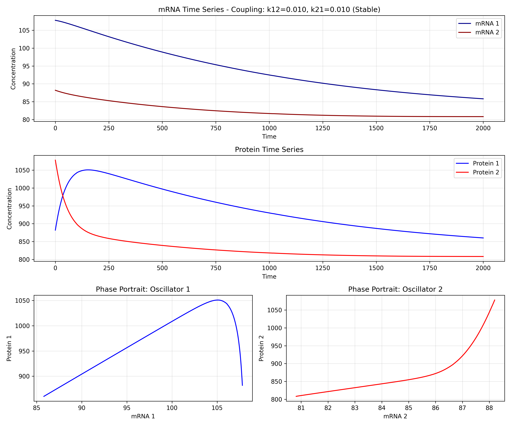
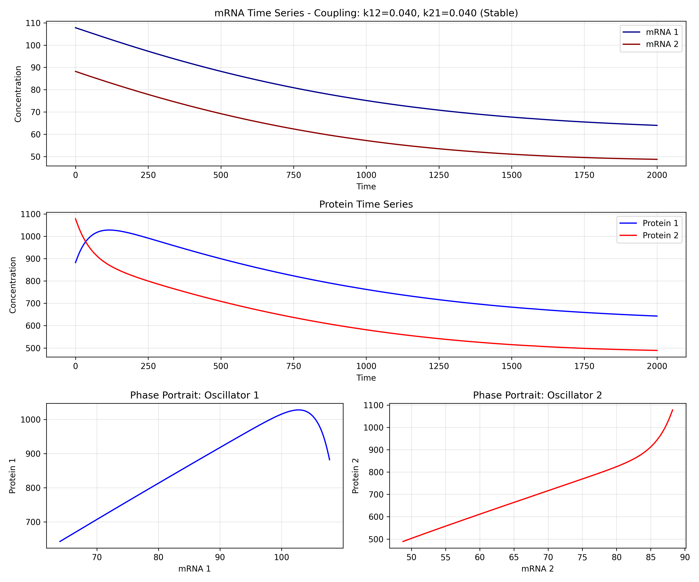
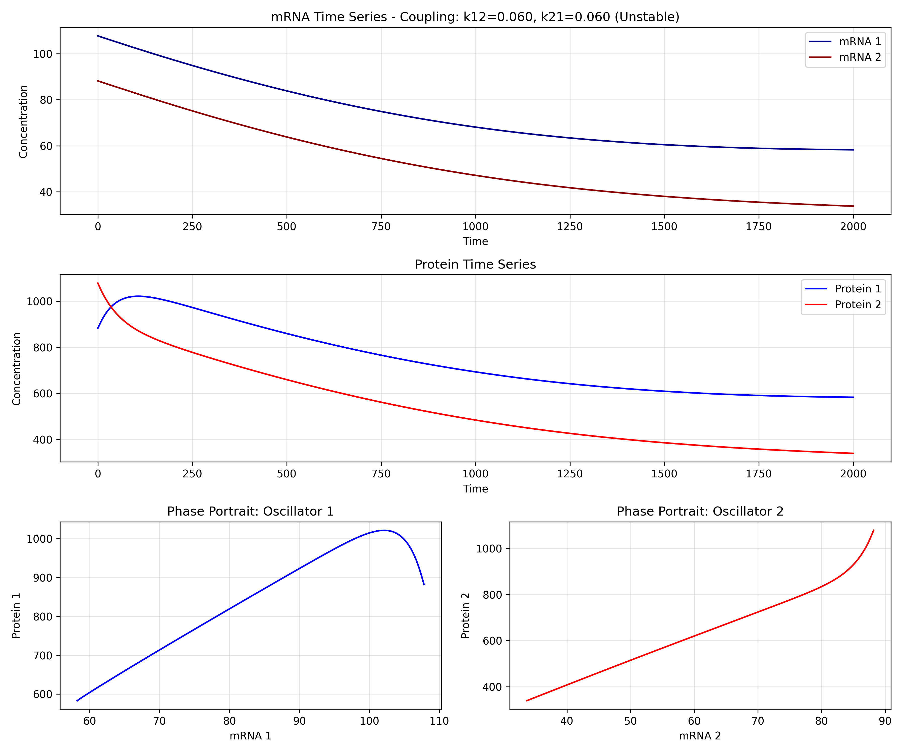
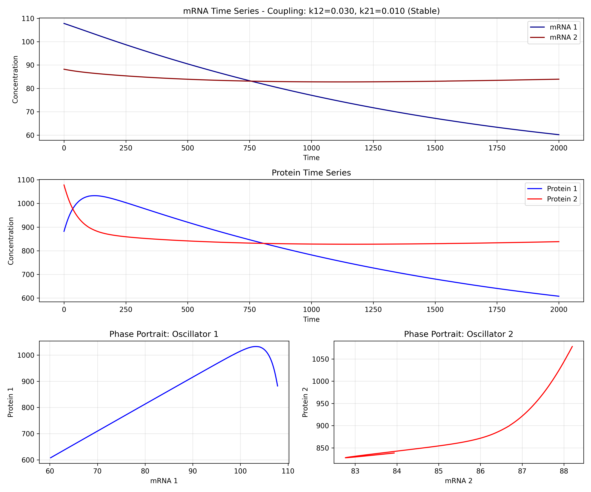
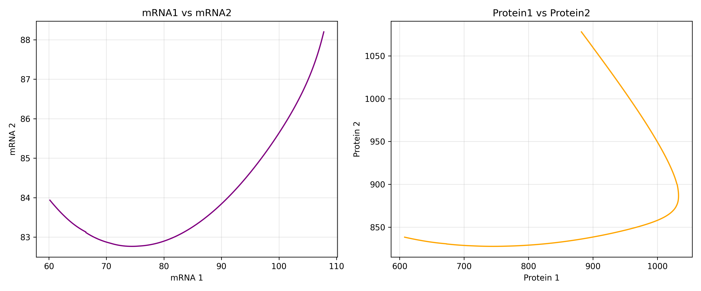

# 🧬 Coupled Epigenetic Oscillators


A sophisticated numerical simulation exploring the dynamics of coupled biological oscillators. This project demonstrates how interacting negative feedback loops can lead to complex coordinated behaviors including synchronization, phase locking, and competitive exclusion.

## 📊 Key Visualizations

| Scenario | Description | Sample Result |
|----------|-------------|---------------|
| Symmetric Weak Coupling | Both oscillators weakly inhibit each other, allowing phase locking with potential phase difference |  |
| Symmetric Strong Coupling (Stable) | Strong but stable mutual inhibition showing enhanced synchronization |  |
| Symmetric Strong Coupling (Unstable) | Strong coupling that violates stability conditions, potentially leading to competitive exclusion |  |
| Asymmetric Coupling | One oscillator dominates the interaction, creating driver-responder dynamics |  |

## 🧪 Project Highlights

- **Interactive Dashboards**: Each simulation run generates an HTML dashboard with comprehensive visualizations and parameter documentation
- **Advanced Mathematical Modeling**: Implementation of Goodwin's framework for coupled oscillatory systems
- **Stability Analysis**: Computational verification of theoretical stability conditions
- **Parameter Exploration**: Command-line tool for exploring the parameter space
- **Time Series Analysis**: Phase relationship investigation using Hilbert transforms
- **Clean Code Architecture**: Modular design with separation of simulation, visualization, and analysis components

## 🔬 The Science Behind It

This project explores a fundamental question in systems biology: **How do interacting genetic oscillators coordinate their behavior?**

The model is based on coupled negative feedback loops, a motif frequently found in biological systems like:
- Circadian rhythm generators
- Cell cycle oscillators
- Genetic toggle switches
- Synthetic biology circuits

The mathematical framework is directly inspired by B.C. Goodwin's pioneering work in his seminal book "Temporal Organization in Cells" (1963), which was one of the first to formalize oscillatory behavior in genetic regulatory networks.

The key finding is that stability depends on the relationship between self-inhibition and cross-inhibition strengths, following the mathematical condition:

```
(k₁₁*k₂₂ - k₁₂*k₂₁) > 0
```

## 🚀 Getting Started

### Installation

```bash
# Clone the repository
git clone https://github.com/yourusername/coupled-oscillators.git
cd coupled-oscillators

# Install dependencies
pip install -r requirements.txt
```

### Quick Start

```bash
# Run the main simulation with default scenarios
python src/coupled_oscillators.py

# Explore custom parameters
python src/parameter_explorer.py --k12 0.04 --k21 0.02 --output custom_sim
```

## 📊 Results Organization

Each simulation run creates a timestamped folder in the `results/` directory containing:

1. **High-resolution plots** for time series, phase portraits, and phase differences
2. **Interactive dashboard** (`dashboard.html`) for exploring results
3. **Detailed documentation** in markdown format
4. **Metadata** in JSON format for programmatic analysis


*Example of a phase comparison plot showing the relationship between oscillator variables*

## 🛠️ Technical Implementation

- **Numerical Integration**: Adaptive step-size ODE solver using SciPy's `solve_ivp` with LSODA
- **Visualization Engine**: Custom plotting system with Matplotlib
- **Parameter Space Exploration**: Flexible command-line interface with argparse
- **Phase Analysis**: Signal processing with Hilbert transforms

## 📘 Mathematical Model

The coupled system is governed by the following differential equations:

```
dX₁/dt = a₁ / (A₁ + k₁₁*Y₁ + k₁₂*Y₂) - b₁
dY₁/dt = α₁*X₁ - β₁*Y₁

dX₂/dt = a₂ / (A₂ + k₂₁*Y₁ + k₂₂*Y₂) - b₂
dY₂/dt = α₂*X₂ - β₂*Y₂
```

Where:
- X₁, Y₁: mRNA and protein concentrations for oscillator 1
- X₂, Y₂: mRNA and protein concentrations for oscillator 2
- k₁₂, k₂₁: Cross-repression coefficients governing oscillator coupling

## 📋 Available Parameters

The parameter explorer supports customization of all model parameters:

**Oscillator Parameters:**
- mRNA synthesis rates (`--a1`, `--a2`)
- Basal repression (`--A1`, `--A2`)
- mRNA degradation (`--b1`, `--b2`)
- Protein synthesis (`--alpha1`, `--alpha2`)
- Protein degradation (`--beta1`, `--beta2`)
- Self-repression (`--k11`, `--k22`)

**Coupling Parameters:**
- Oscillator 1 inhibition by Oscillator 2 (`--k12`)
- Oscillator 2 inhibition by Oscillator 1 (`--k21`)

## 🧠 What I Learned

This project demonstrates:
- Implementation of complex differential equation systems
- Numerical simulation techniques for coupled oscillators
- Advanced visualization for time series data
- Parameter space exploration and stability analysis
- Biological model interpretation

## 📈 Future Extensions

- Stochastic simulation incorporating molecular noise
- Multi-oscillator networks (>2 oscillators)
- Machine learning for parameter inference from experimental data
- Additional coupling architectures (activation, enzymatic)
- 3D visualization of parameter space stability regions

## 📚 References

1. Goodwin, B.C. (1963). *Temporal Organization in Cells: A Dynamic Theory of Cellular Control Processes*. Academic Press, London.

---

*This project was developed as part of computational biology research on coupled genetic oscillatory systems, inspired by the pioneering work of B.C. Goodwin.* 